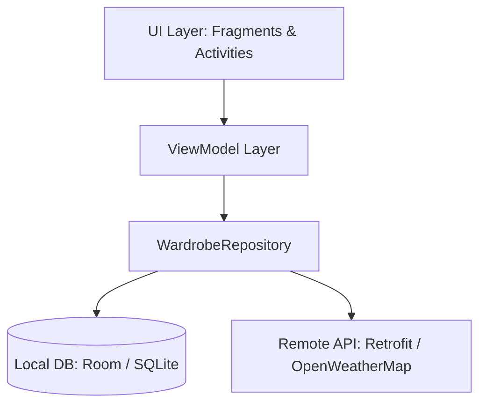

# Smart Wardrobe 👕👗

Smart Wardrobe is an interactive native Android application designed to help users digitize their wardrobe, manage their clothing items, track Cost-Per-Wear (CPW) analytics, and receive algorithmic outfit recommendations from a rule-based styling engine.

This project forms part of my Final Year Project (FYP).

---

## 🚀 Key Modules & Features

### 1. User Authentication & Profile Settings (`LoginActivity`, `SignUpActivity`, `ProfileFragment`)
* **Secure Auth**: Local registration and session management powered by SQLite (`UserProfile` table) with secure password hashing (`HashUtils`).
* **Styling Preferences**: Flexible styling preferences (favorite colors, preferred dress codes) saved as serialized JSON strings for schema extensibility.
* **Daily Reminders**: Automated notification system triggered at 8:00 AM using `AlarmManager` and `DailyReminderReceiver` to remind users to log their outfits.

### 2. Digital Wardrobe Management (`WardrobeFragment`, `AddItemActivity`)
* **Clothing Cataloging**: Add garments with custom photos, category (T-Shirt, Pants, Shoes, Jacket, etc.), fabric type, color hex code, and purchase price.
* **Glide Image Loading**: Native image decoding and caching, with seamless transparent PNG support for clean layering in recommendations.
* **Dynamic Grid**: View and search all clothing items, filtering them dynamically by category.

### 3. Algorithmic Styling Engine (`StylistFragment`, `StylingOntology`)
* **Deterministic Rules (Ontology)**: Employs a semantic, rule-based recommendation table (`styling_ontology`) mapping dress codes (e.g., Casual, Formal) and maximum temperature limits to acceptable clothing categories.
* **Weather & Coordinates Pairing**: Fetches current coordinates and outdoor temperature in real-time from the **OpenWeatherMap API** via **Retrofit 2**.
* **Recency Filter**: To prevent repetition, a SQL-driven recency query detects and **excludes** any wardrobe item worn within the last 3 days (`calendar_event`).

### 4. Interactive Analytics Dashboard (`AnalyticsFragment`)
* **Cost-Per-Wear (CPW) Analysis**: Computes ROI metrics on a per-garment basis: 
  $$\text{CPW} = \frac{\text{Purchase Price}}{\text{Total Wear Events}}$$
* **Custom Donut Chart (`PieChartView`)**: Custom Android Canvas-drawn, animated donut chart visualizing the percentage distribution of clothing categories.
* **Optimized Wardrobe Insights**: Lists the most worn and least worn clothing items.

---

## 🏗️ Technical Architecture

The project is built on **Android Jetpack** and modern architectural patterns:

* **Pattern**: Model-View-ViewModel (MVVM) for separation of concerns and lifecycle safety.
* **Repository Pattern**: `WardrobeRepository` abstracts data access, unifying local persistence (Room) and remote web APIs (Retrofit).
* **Asynchronous Operations**: Uses **RxJava 3** (`Single`, `Observable`) for robust background execution of network calls and database queries.



### 💾 Room Database Schema

The SQLite schema consists of 4 main tables:
1. `user_profile`: User credentials and JSON-formatted setting preferences.
2. `wardrobe_item`: Clothing item attributes (category, price, color, image path).
3. `calendar_event`: A junction wear-log mapping `user_id` and `item_id` to timestamps (`date_worn`).
4. `styling_ontology`: Rule records defining acceptable category arrays and temperature thresholds.

---

## 🛠️ Tech Stack & SDK Details

* **Min SDK**: API 26 (Android 8.0 Oreo)
* **Compile / Target SDK**: API 35 (Android 15)
* **Language / Platform**: Java (JDK 17)
* **View Framework**: View Binding with XML and Google Material Design 3 components
* **Reactive Core**: RxJava 3 & RxAndroid
* **Network Client**: Retrofit 2, OkHttp 3, and Gson Converter
* **Local Persistence**: Room DB (Runtime ORM)
* **Image Processing**: Glide

---

## ⚙️ Development & Testing Utilities (`/scratch`)

A set of automated Python helper scripts is provided in the [scratch](file:///c:/Users/User/AndroidStudioProjects/AimanNewFyp/scratch) directory:
* [pull_db.py](file:///c:/Users/User/AndroidStudioProjects/AimanNewFyp/scratch/pull_db.py): Extracts the Room SQLite database file from a running emulator or debug device.
* [check_db.py](file:///c:/Users/User/AndroidStudioProjects/AimanNewFyp/scratch/check_db.py): Validates database health and displays table records.
* [migrate_local_db.py](file:///c:/Users/User/AndroidStudioProjects/AimanNewFyp/scratch/migrate_local_db.py): Runs offline schema updates and sample data seeding.

---

## 📸 App Screenshots

| Wardrobe Dashboard | Stylist Recommendations | Analytics Dashboard | Profile / Settings |
|:---:|:---:|:---:|:---:|
|  |  |  |  |

---

## 📥 How to Run the Project

1. **Clone the repository**:
   ```bash
   git clone https://github.com/Uinaa0/YOUR-REPOSITORY-NAME.git
   ```
2. **Open in Android Studio**:
   * Select **File > Open** and choose the `AimanNewFyp` root directory.
   * Allow Gradle build to sync and download dependencies.
3. **Run the App**:
   * Build the project and deploy it on an Android Emulator or a physical device (API level 26+ recommended).

